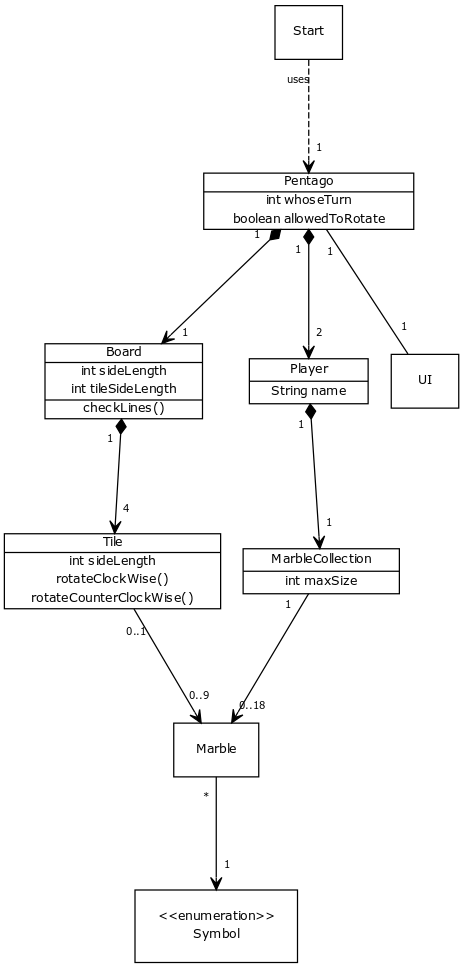

## Topic
A programmed version of the two-player-game named Pentago. This version only should have the working graphical version of the game with the possibility to play against another human.

### Rules of Pentago
Pentago board consists of 4 tiles in a square form, each of which has 9 squares in a square. So the board has 6x6 squares in 4 tiles.

The game has two players. One with black and on with white marbles. It doesn't matter, whom of the players starts.

On every turn, the player whose turn it is must put one of their marbles into one of the 36 squares and rotate one of the 4 tiles 90° into a direction of one's choice. The tile doesn't have to be the same, where the marble was just put in. After that the another player gets the turn and does the same with their marbles. However, the player is not allowed to rotate the same tile which was just rotated back to the opposite direction. Rotating the same tile to the same direction is allowed.

The winner is the player, who first gets 5 of their marbles in a row, horizontally, vertically or diagonally. If the board gets full without any of the players getting 5 in line, the game is tied, and an another on can be started.

More accurate rules and strategies can be seen [here](https://webdav.info.ucl.ac.be/webdav/ingi2261/ProblemSet3/PentagoRulesStrategy.pdf)

### The Use Cases
* A player
    * Can start a new game
    * Can play a game (on their turn)
        * Can put a marble on a board
        * Can rotate one of the 4 tiles (but not back to the direction where it was just rotated from)
    * Can win the game

### Views in the program
* Main menu
    * Start new game
* The game
    * Board
    * Indicator that shows the amount of the remaining marbles

### Class Diagram

