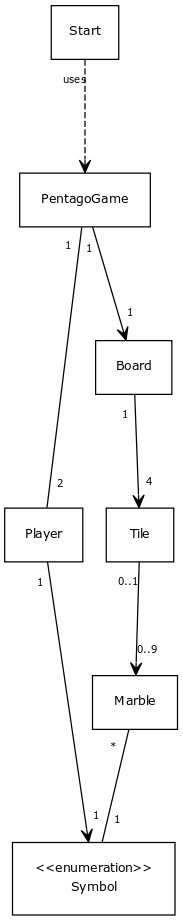
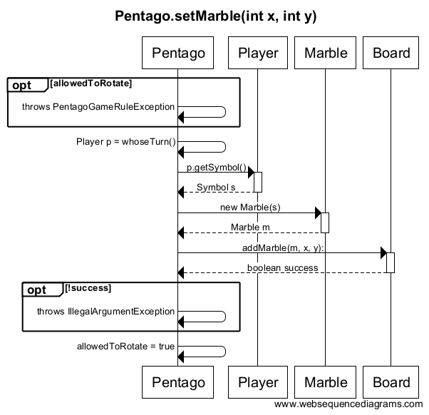
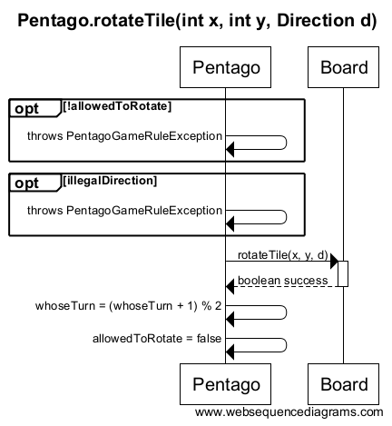

## Topic
A programmed version of the two-player-game named Pentago. This version only should have the working graphical version of the game with the possibility to play against another human.

### Rules and User Guide
[Are found from here](user-guide-and-rules.md)

### The Use Cases
* A player
    * Can start a new game
    * Can play a game (on their turn)
        * Can put a marble on a board
        * Can rotate one of the 4 tiles (but not back to the direction where it was just rotated from)
    * Can win the game

### Views in the program
* Main menu
    * Start new game
* The game
    * Board
    * Buttons to rotate a tile to the selected direction

### Class Structure Explained a Bit
When started, Start checks arguments and starts whether GUI or TextUI. Both of the UIs do the same: create a new Pentago, and start it. 
Pentago creates a new Board, and two Player instances. While Player only contains the name and symbol of the Player, Board consists of four Tiles. Each of the Tiles consist of 0...sideLength^2 Marbles. A Marble has only a Symbol. Symbol is an enum, which has two different constants, O and X.
This way each of the Marbles can be connected to a single Player.

### Class Diagram

## Sequence Diagrams

